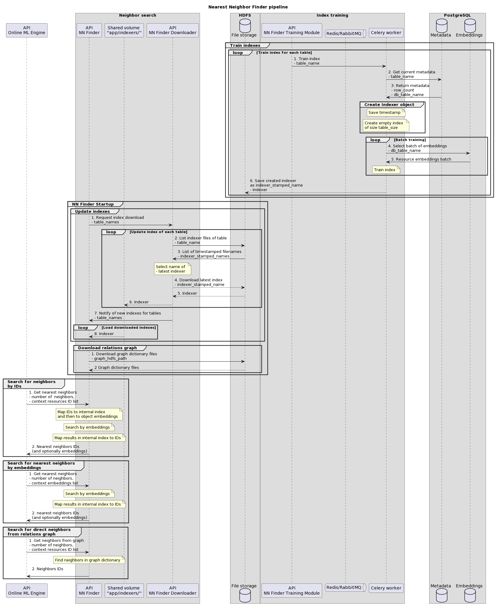

# Licence

<! --- SPDX-License-Identifier: CC-BY-4.0  -- >

## System Architecture

Nearest Neighbor Finder Training Module is a supporting module for the main NN Finder application. It is responsible for training indexes for nearest neighbor search and saving them in HDFS The whole NN Finder system consists of three modules:

1. **NN Finder** - main app serving nearest neighbor search requests
2. **NN Finder Downloader** - app serving as a buffer for index updates. This module is required for the main app to fully function in its default CONFIGURATION. It allows the NN Finder to continuously serve requests while newly trained indexes are downloaded from HDFS storage.
3. **NN Finder Training Module** - module conducting the training of indexes and passing the train tasks to celery workers. It works independently from the main app and only communicates with HDFS storage. Training is performed ad hoc (on API request) for resource indexes, and dynamically (every 30 minutes) for user indexes.

The main NN Finder module and the supporting Downloader service can be found in a [separate repository](https://git.man.poznan.pl/stash/projects/EOSC-RS/repos/nearest-neighbor-finder/browse).



### Dependencies
The requirements for the modules described here are:
- **Docker**
  - [docker-compose](https://docs.docker.com/compose/install/)
- **Python 3.8**
  - Packages listed out in [requirements.txt](requirements.txt) will be installed when building docker image
- **Celery** (obraz worker w repozytorium) na osobnej maszynie
  - **Redis/RabbitMQ** as Broker app for sending tasks to celery workers (CELERY_BROKER_URL)
  - **Redis** as Backend app for storing results (CELERY_BACKEND_URL) - if Redis is used as Broker, the same instance can be used
  - Optional: **Celery Flower** monitor service (gregsi/latest-celery-flower-docker image) for monitoring of training tasks
- **PostgreSQL** containing the following tables of embeddings:
  - in `metadata` schema: table for both resource types, each containing entries for every table of that type
  - in `"resources"` schema: `"datasets", "publications", "software", "services", "other_research_product", "trainings", "data_srouces"`
  - in `"users"` schema: `"users", "users_aai", "users_anon"` with columns for each configuration of user actions (ordered, visited) x resources (datasets, publications, services, software, trainings, other_research_product, data_sources)
- **HDFS** containing the following data:
  - directory `user/{HDFS_USER}/nn-finder/{INDEX_TAG}/` with folders for index storage of each table type: `"datasets", "publications", "software", "services", "other_research_product", "trainings", "data_srouces", "users", "users_aai", "users_anon"`

### Overview


The objective of this module is to provide a training endpoint for the nearest neighbor index. The training tasks are performed by Celery workers, and the app utilizes distributed task queue systems RabbitMQ and Celery for training of multiple indexes. Apart from health checks, the Training Module API only communicates with the worker, which collects all the necessary data from PostgreSQL and saves the resulting index files to HDFS.

To see how to train the index using this API, see [API](#api) section down below, and the file [LOAD_NEW_DATA.md](../LOAD_NEW_DATA.md).

#### Batch filtering & training

The training is performed in batches to avoid memory overflow, with each batch containing a subset of all the embeddings. The batch size for each of the tables is defined in `tables_config.json`.

Before adding the batch to index, the objects are filtered, ignoring those that are:
- encoded with empty (zeroed-out) embeddings
- invalid (as stated in column `isvalid`)
- lacking support for languages specified in `RESOURCE_LANGUAGES`.

Each filtering step can be turned off by setting configuration variables to False:
- `REMOVE_ZEROED_USERS`,
- `REMOVE_ZEROED_RESOURCES` (default value is False by design),
- `REMOVE_INVALID_RESOURCES`,
- `REMOVE_FOREIGN_RESOURCES`.

The filtering in terms of validity and language does not concern the Users indexes. At each filtering step, the objects will not be removed if it would result in a batch smaller than 8 objects, which is a minimum size of embeddings that have to be added to index.

#### Loading new indexes

After the index is trained, it can be downloaded by the main module NN FInder through the NN Finder Downloader and used for search. To see the process of loading new indexes to NN Finder can be done by following `LOAD_NEW_DATA.md` file in NN Finder repository.

### API

#### Train endpoint

The `/train`  endpoint creates and trains an index for a specific dataset. The data source for the new index has to be chosen in the `data_source` parameter. If the table corresponds to user objects (tables "users", "users_aai", "users_anon"), additional parameters have to be provided in order to specify the table, which are user_action and user_resource.

A celery worker instance is assigned the training task, so that multiple tasks can be queued or performed simultaneously by several workers. After the index is trained, it is stored in HDFS, while the name of the index file consists of the source data table name and a beginning timestamp of the training request. In order to save disk space, the app deletes the oldest present index if there are already N indexes of a single data set present in HDFS, where the number N is specified by the `MAX_N_INDEXERS` environment variable.

Because of the dynamic changes in user tables, those specified in the `DYNAMIC_TABLES` environment variable are cyclically trained, in intervals specified by `DYNAMIC_TRAINING_INTERVAL` variable in minutes.

Additionally, the `/train_all/{table_type}` endpoint can be used to train all tables of specified type using only one request, where the value of table_type can be users or resources.

You can also see [LOAD_NEW_DATA.md](../LOAD_NEW_DATA.md) for a step-by-step training guide.

##### Diagnostic endpoint

The endpoint '/diag' is used to check the state of the API. If the app is running properly, this endpoint should return a `200` response with a `status: "UP"`, as well as states of modules that the application depends on. HDFS connection status is checked, and the indexes available for download are listed out. Connection with PostgreSQL is also checked, returning a list of tables on which new indexes can be trained.

Setting the flag `details` to `True` will list out additional information about the data contained in its dependencies.

Example response with the parameter `details=True`:

```JSON
{
  "status": "UP",,
  "version": "1.4.2",
  "index tag": "1.4.2",
  "celery": {
    "status": "UP"
  }
  "hdfs": {
    "status": "UP",
    "datasets_indexer": [
      "datasets-230727062945.pickle",
      "datasets-230727143755.pickle"
    ],
    "publications_indexer": [
      "publications-230726090528.pickle",
      "publications-230727144621.pickle"
    ],
    "software_indexer": [
      "software-230727063039.pickle",
      ....
    ],
    "otherresearchproduct_indexer": [
      "otherresearchproduct-230727143755.pickle",
      ...
    ],
    "services_indexer": [
      "services-230727143755.pickle",
      ...
    ],
    "trainings_indexer": [
      "trainings-230727143755.pickle"
      ...
    ],
    "users_indexer": [
      "users-datasets-ordered-230606133556.pickle",
      "users-datasets-ordered-230606140140.pickle",
      ...
      "users-datasets-visited-230801080908.pickle",
      ...
      "users-otherresearchproduct-ordered-230801080913.pickle",
      ],
    ...
  },
  "pg": {
    "status": "UP",
    "available_tables": [
      "services",
      "datasets",
      "publications",
      "software",
      "trainings",
      "otherresearchproduct",
      "users",
      "users_aai",
      "users_anon"
    ]
  }
}
```
