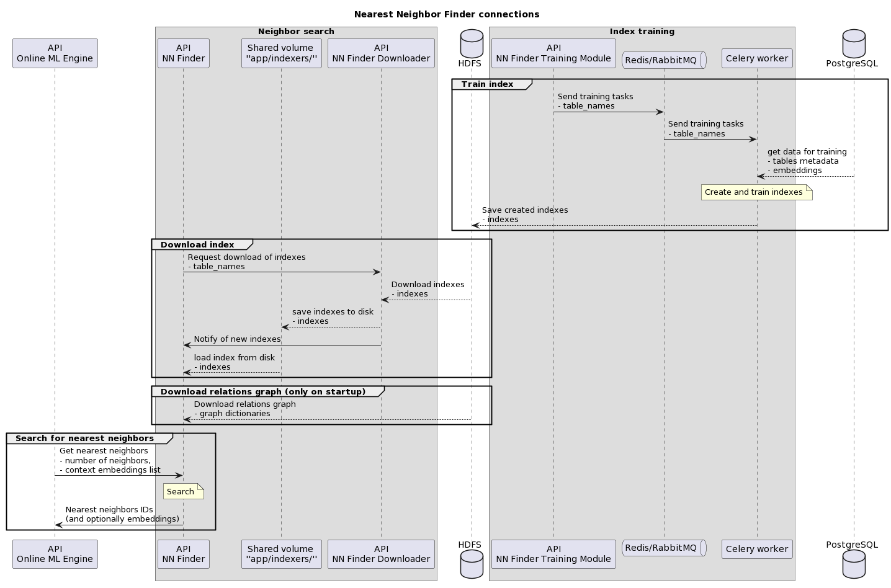

# Licence

<! --- SPDX-License-Identifier: CC-BY-4.0  -- >

## Introduction

This documentation concerns the deployment and maintenance of the NN Finder application. It is intended for developers who:
- maintain the application
- deploy the application on the server
- deploy other modules that communicate with NN Finder

The Nearest Neighbor Finder (NN Finder) module is used for quickly finding the most similar objects of a specified type, like EOSC e-infrastructure resources, OARG datasets etc. Similar objects are the ones in the closest neighborhood of the queried object based on the distance between their description vectors (embeddings). Alternatively, neighbors can be fetched from a resource relations graph with direct connections. The only consumer of the data produced by NN Finder is Online Engine.

The neighborhood search operation can be performed efficiently thanks to indexes utilizing approximate search algorithms. These indexes need to first be built and trained on the object embeddings. They are wrapped in Indexer objects and saved as files in storage (HDFS). For each resource type, there is a PostgreSQL table containing the embeddings describing all objects of this type. Every one of those tables has a separate index for neighbor search.

This repository comprises two modules:
- `Nearest Neighbor Finder API`, or `NN Finder` in short. It is the main application that provides the API for searching for nearest neighbors in the database and in the relations graph.
- `NN Finder Downloader` which supports the main NN Finder application. It is a separate submodule that downloads data from HDFS and stores it in the local volume shared with NN Finder. It does not communicate with any other module other than NN Finder and HDFS.
Another module, `NN Finder Training Module`, is also needed for the proper functioning of the system, but it is separately documented in its own repository.

See [system architecture](SYSTEM-ARCHITECTURE.md) for detailed description of the modules.

For the process of deploying the system see [Building](BUILDING.md) and [Deployment](DEPLOYMENT.md).

For details on configuring the system and monitoring its performance see [Configuration](CONFIGURATION.md), [Scaling and Performance](SCALING-PERFORMANCE.md) and [Monitoring and Logging](MONITORING-LOGGING.md).

For details on maintaining the system and procedures in specific scenarios see [Maintenance](MAINTENANCE.md), [Troubleshooting](TROUBLESHOOTING.md) and [Backup and Recovery](BACKUP-RECOVERY.md)

[Security](SECURITY.md) concerns the rules for responsible deployment of the system.

See [References](REFERENCES.md) as for sources and documentation that can help explain the specifics and the context of this applicaiton in the whole system.
