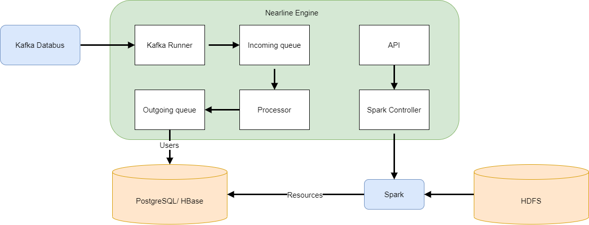
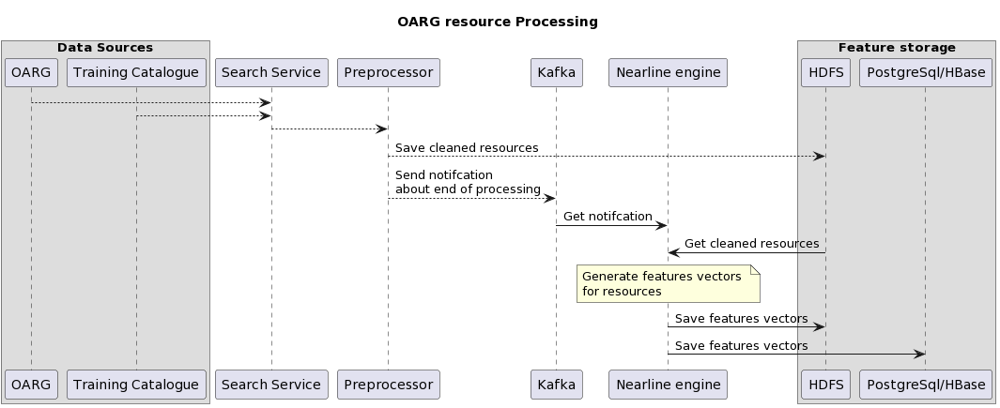
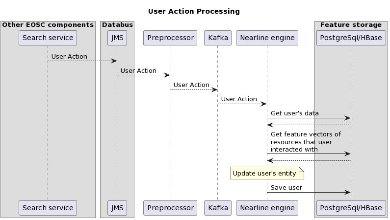

# Licence

<! --- SPDX-License-Identifier: CC-BY-4.0 -- >

## System Architecture

The application consists of 3 main components:

* KafkaRunner - Gathering messages from Kafka's topics put there by Preprocessor.
* Processor - Transforming data into a form that can be used by the Online Engine. (Embedding generation)
* incoming and outgoing queues - holds information in between steps and allows to scale the system.

The external services that Nearline Engine connects to are:

* Databases (PostgreSQL / HBase) - store information about metadata, users, resources,
* Data Lake (HDFS) - stores data about resources,
* Kafka - receiving messages from Preprocessor,
* Spark - processing resource data.

The module consists of 2 parts:

### Resource processing

This part is responsible for creation of feature vectors for OAGR resources and other services.
It is done using Bert model.

Module takes data saved on HDFS previously process by Preprocessor and save it into appropriate databases.

Next, the Nearest Neighbor Finder Training Module creates an index for these feature vectors.
Following that, these feature vectors are used to generate recommendations by an online engine and to determine
similarity between resources in NNFinder.

### Creation of user entities

This part take data from internal databus (Kafka) which is put there by Preprocessor. This data consist of
action which is performed by logged-in and anonymous users and also all changes in services mady by changes
in Marketplace database.

On the basic of events called User Actions (UA), the module manages the user entities. Such User Actions are
composed of the user activity (ordering or visiting the resource), the type of this resource, and its ID.
Then, many UA created by a single user are combined with changes in the user's Marketplace profile.
Using all of this knowledge, feature vectors are created for users.

This part also applies change to feature vectors for services.

Module supports saving and reading to/from PostgreSQL and HBase independently (one of the databases can
be turned off and this will not affect the other).

### Kafka Topics

The module uses 5 Kafka topics, all are created by Preprocessor:

| Topic environmental variable | Description                                                                                 | Example                                                                                                                                                                                                                                                                                                                                                                                                            |
|------------------------------|---------------------------------------------------------------------------------------------|--------------------------------------------------------------------------------------------------------------------------------------------------------------------------------------------------------------------------------------------------------------------------------------------------------------------------------------------------------------------------------------------------------------------|
| `KAFKA_TOPIC_UA`             | Basic user actions. If "isAnonymous" is equal `true`, no fields "aaiUid" i "marketplaceId". | {   "sessionId": "example_session_id",   "isAnonymous": false, "aaiUid": "example_aaiUid", "marketplaceId": "2576",   "numberOfUA": 3, "userActions": [ { "timestamp": "2023-01-05 12:48:36.493", "pageId": "/page/id", "resourceType": "service", "resourceId": "5", "rootType": "other", "actionType": "browser action", "isOrderAction": false }, ... ] } |
| `KAFKA_TOPIC_USER`           | Updates in user profiles.                                                                   | {   "eventType": "update",  "aaiId": "example_aaiId",  "marketplaceId": "14", "scientificDomainValues": [9],  "categoryValues": [8],  "accessedServiceValues": [2,2,76]  }                                                                                                                                                                                                                    |
| `KAFKA_TOPIC_SERVICE`        | Updates in services profiles.                                                               | {   "eventType": "update",   "id": "1", "name": "Sample service", "scientificDomainValues": [9], "categoryValues": [8], "relatedServices": [2,2,76] }                                                                                                                                                                                                                                         |
| `KAFKA_TOPIC_TRAINING`       | Updates in trainings profiles.                                                              | {   "eventType": 'update',   'id': 'sample_id',  'title': 'Test',    'description': 'Sample description',   'accessRights': 'tr_access_right-open_access',  'languages': ['en', 'af', 'zu'],   'scientificDomains': [...]}                                                                                                                                                                    |                                                                                                                                                                                                                                                                                                                                                                                                                  |
| `KAFKA_LIKE_TOPIC`           | Information's about likes and dislikes of users.                                            | {   "aaiUid": "example_aaiUid", "uniqueId": "uniqueId", "clientId": "user_dashboard", "timestamp": "2022-10-08T09:32:47.788", "actionType": "recommendation evaluation", "visitId": "visitId", "resourceType": "service", "resourceId": "483", "suggestion": "custom suggestion", "action": "dislike",  "reason": [ "Not Relevant" ] }                                   |
