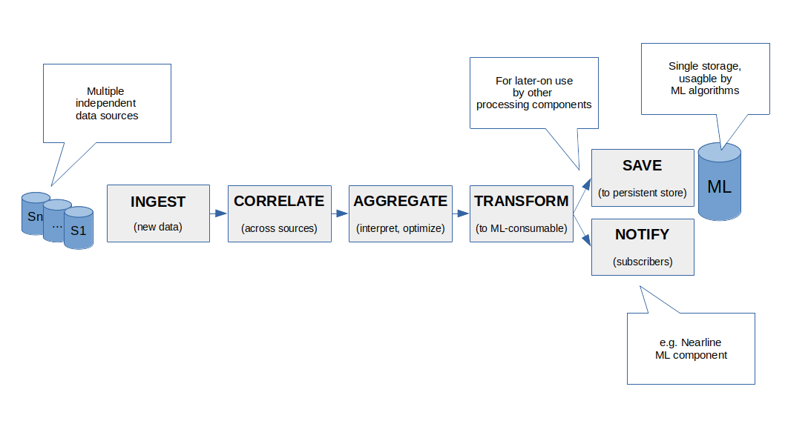

# Licence

<! --- SPDX-License-Identifier: CC-BY-4.0  -- >

## System Architecture

The Preprocessor is a component of the Recommender System (RS), deployable as a standalone service. 
The preprocessor is responsible for delivery of data to a set of AI-based components. 
In particular, it performs data ingestion, initial transformation, saving and notification.
It is a first step in the data processing workflow implemented by the RS. 
An OpenAIRE Research Graph is one of many data sources to be processed by the preprocessor.

The preprocessor implements the following data-handling process according to dump processing: (1) INGEST, (2) CORRELATE, (3) AGGREGATE, (4) TRANSFORM, (5) SAVE and (6) NOTIFY.
1. **INGESTION** First, data are ingested (imported, acquired in any way) from multiple data sources. See: Types and sources of data.
2. **CORRELATION** Ingested data need to be correlated so that they can become a single and consistent source of data. For example: if users' data may come from multiple sources then there is a need to match (and preferably merge) different data records relating to the same physical person. See: Correlating data from various sources.
3. **AGGREGATION** Collected data are not necessarily needed in their raw form. Some of them may be processed and then removed. As a result, the size of data that reach the SAVE/NOTIFY is minimized.
4. **TRANSFORMATION** In some cases data are transformed into an intermediate format understandable by ML-algorithms. See: Transformations done in preprocessor.
5. **SAVE & NOTIFY** Transformed data are persisted in order to be shared with data consumers. Next, consumers are immediately notified about data availability.

## Interaction with external components

### Search Service
The interaction is via S3 storage.
Downloading a database dump,  it will contain OAG (and other data sources) preprocessed by Search Service.

### JMS
There is a direct integration with so-called "data bus" is needed to let the preprocessor listen for real-time events, e.g. related to actions taken by users of the Marketplace.

### Marketplace
There is an indirect interaction with Marketplace via the data bus infrastructure. The Marketplace is a "producer" of events, e.g. representing the Marketplace's user actions.

### Interaction with other RS components
* Data exchange. Technology: Apache Spark. Purpose: exchange of huge amount of data with ability for query for specific data.
* Messaging. Technology: Apache Kafka. Purpose: exchange of events, to notify about that availability and changes.

### Implementation and architecture
Distribution format:	Docker image
Base framework: Java 17 LTS (OpenJDK) + Spring Boot + Apache Spark

#### Communication interfaces and storage
* JMS
* S3
* PostgreSQL
* Apache Kafka
* Apache Hadoop
* Apache Spark

Rationale for selected technology

* OpenJDK 17 LTS is a newest Java platform released in the "Long Term Support" distribution model, supported by Oracle.
* Spring * frameworks are mature Java-based solutions designed for modern applications.
* Apache Spark - a Unified Engine for large-scale data analytics. It is a multi-language engine for executing data engineering, data science, and machine learning on single-node machines or clusters.