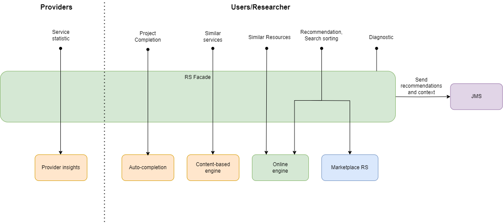

# Licence

<! --- SPDX-License-Identifier: CC-BY-4.0  -- >

## System Architecture

The RS Facade is responsible for offering a consistent API for the entire EOSC Recommendation System. Its task is to mediate between the modules generating recommendations (Online engine, Marketplace Recommender System ...) and external services (Search Service, User Dashboard ...). It divides its tasks between the individual recommendation modules then collects the results, aggregates them, and performs re-ranking if necessary. A
Transmitted requests to the Facade do not change in any way and are sent directly to the service that is responsible for handling them.
Responses to personalized recommendations of resources generated by Online engine and Marketplace RS are aggregated into a single list of suggested resources.

Additionally, RS Facade sends logs with requests and recommendations from individual modems to JMS.

The external services that RS Facade connects to are:
* [Online engine](https://git.man.poznan.pl/stash/projects/EOSC-RS/repos/online-ml-ai-engine/browse)
* [Marketplace RS](https://github.com/cyfronet-fid/recommender-system)
* [Content-based engine](https://github.com/athenarc/EOSCF-ContentBasedRS) 
* [Auto-completion](https://github.com/athenarc/EOSCF-Autocompletion) 
* [Provider insights](https://github.com/athenarc/EOSCF-Provider-Insights) 
* `JMS`

The RS Facade also mediates the diagnostic check of the entire recommender system by sending requests to each component checking the health of that service.
In addition to the above modules, the following are also checked for health status:

* [Preprocessor](https://git.man.poznan.pl/stash/projects/EOSC-RS/repos/preprocessor/browse) 
* [Nearline engine](https://git.man.poznan.pl/stash/projects/EOSC-RS/repos/nearline-ml-ai-engine/browse) 
* [Nearest neighbor finder](https://git.man.poznan.pl/stash/projects/EOSC-RS/repos/nearest-neighbor-finder/browse)
* [Nearest neighbor finder training module](https://git.man.poznan.pl/stash/projects/EOSC-RS/repos/nearest-neighbor-finder-training-module/browse)

