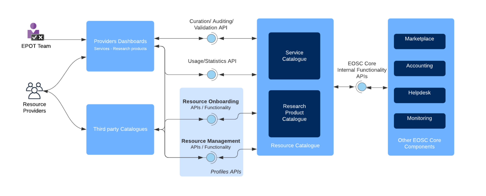
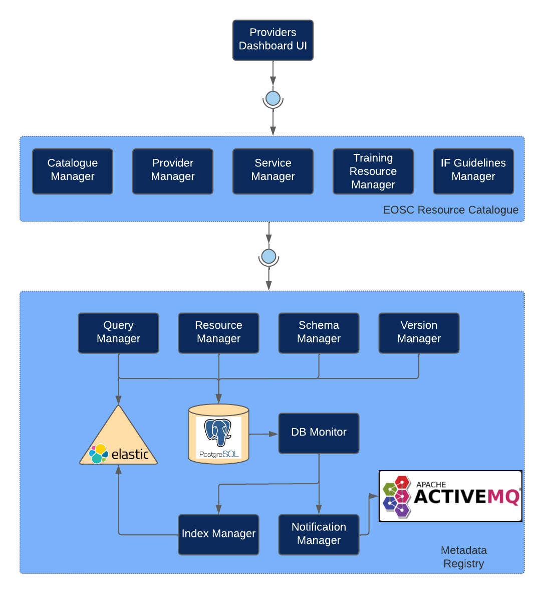

# Licence

<! --- SPDX-License-Identifier: CC-BY-4.0  -- >

## System Architecture

### High-level Service Architecture

The following picture explains the general architecture of the EOSC Resource Catalogue and subcomponent interactions

* EOSC Service Catalogue: The EOSC Service Catalogue is the repository component offering the necessary programmatic interfaces for the addition, modification, and access to information regarding providers, resources and user activity collected in the EOSC portal.
* EOSC Providers Portal: The EOSC Providers Portal components offer front-end functionality to users representing a Provider organisation, who wish to onboard their organisation and onboard resources in the EOSC Resource Catalogue, to manage and customise the way offerings are presented to end users and finally to gain insights on a multitude of usage statistics, user-generated events and statistics collected. 
* EOSC Research Product Catalogue: The Research Product Catalogue is a public and open access collection of metadata and semantic links (~1B) between research-related entities collected from data sources (2400+) or inferred from PDFs (14M+). Entities are research products, namely articles (124M+), datasets (14M+), software (200K+), and other research products (8Mi+), organisations (250,000), funders (~25), funding streams, projects (3.5Mi+), research communities (7), and data sources (~80K).

### EOSC Service Catalogue

The Service Catalogue is a service comprising of three main components:
* A general purpose Metadata Registry configured and deployed specifically for the metadata of the Service Catalogue, and
* The business layer specific to the Service Catalogue. This layer contains a module for each of the main entities stored in the Service Catalogue: Catalogue, Provicer, Service, TrainingResource, and Interoperability guidelines. Each of these modules implements the functionality required for each resource type, such as onboarding, updating, auditing, etc.
* The Providers' Dashboard, which is the main gateway for content providers (to register and manage their content in EOSC) and EOSC onboarding team to administer, monitor and audit the content.
