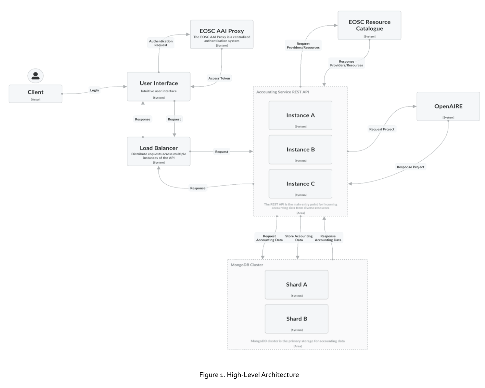

# Licence

<! --- SPDX-License-Identifier: CC-BY-4.0  -- >

## System Architecture

The Accounting Service is responsible for collecting data from a variety of sources, including different resources, projects, providers, and installations. This data is collected and processed in a centralised database, allowing clients to access and analyse accounting data across multiple systems and projects.

Τhe Accounting Service architecture could be structured as follows:

### Functional aspects

- `User Interface:` The user interface is the primary point of interaction for clients to access the Accounting Service. It provides a graphical interface that allows users to view and interact with accounting data.

- `REST API:` The REST API is the main entry point for incoming accounting data from diverse resources. It receives input data from external systems and stores it in the database. The API is responsible for aggregating and processing the data, making it available for querying through the user interface.

- `Authentication and Authorization:` The Accounting Service uses the EOSC AAI Proxy for authentication, which provides a single sign-on mechanism for clients to access the service. Once authenticated, clients are granted access to the system based on their role-based access control (RBAC) permissions. The authorization system is responsible for managing user access and permissions and enforcing security policies.

- `Database:` The database is the primary storage for accounting data. It receives incoming data from the REST API and stores it in a structured format that enables efficient querying and reporting. The database also supports data aggregation, which allows for the calculation of metrics.

### Non-functional aspects

- `Integration and Interoperability:` The Accounting Service is designed to integrate with other systems and services within the EOSC ecosystem. It provides APIs for external systems to access accounting data, and it can also consume data from other systems to enrich its own data. The Accounting Service also supports interoperability with different infrastructure providers and projects, enabling seamless data exchange and aggregation.

- `High Availability:` high availability for the Accounting API involves ensuring that the API is always available to handle requests, even in the face of hardware failures, network outages, and other types of disruptions. Our high-availability architecture contains :

- `Load Balancing:` Deploying multiple instances of the API and using a load balancer to distribute requests across them, ensuring that no single instance is overloaded.
  Replication: Maintaining copies of the API’s data and code across multiple servers, so that if one server fails, another can take over seamlessly.

- `Monitoring and Alerting:` Continuously monitoring the API and sending alerts if any issues arise.

