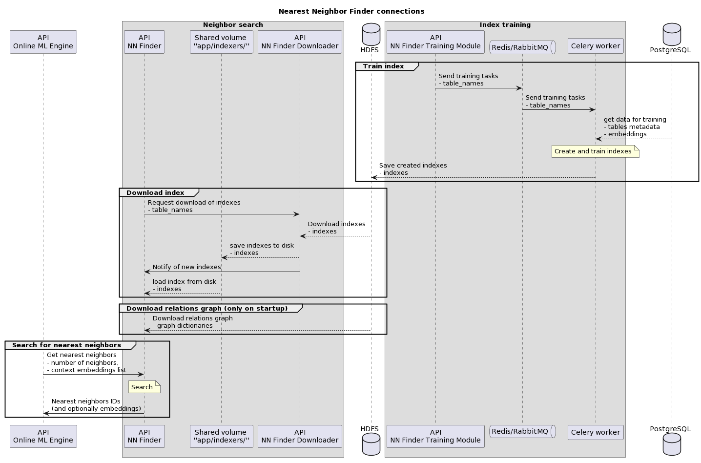

# Licence

<! --- SPDX-License-Identifier: CC-BY-4.0  -- >

## Introduction

This documentation concerns the deployment and maintenance of the NN Finder Training Module, which supports the main NN Finder application. It is intended for developers who:
- maintain the application
- deploy the application on the server
- deploy other modules that communicate with NN Finder

The NN Finder Training Module provides indexes that allow the nearest neighbor search performed by NN Finder. To learn more about the NN Finder application navigate to documentation in [NN Finder repository](https://git.man.poznan.pl/stash/projects/EOSC-RS/repos/nearest-neighbor-finder/browse).

To see how to train indexes using the API, see the API section of [System Architecture](SYSTEM-ARCHITECTURE.md), and the file [LOAD_NEW_DATA.md](../LOAD_NEW_DATA.md).

For each resource type, there is a PostgreSQL table containing the embeddings describing all objects of this type. Every one of those tables has a separate index for neighbor search. Training of those indexes, initiated by the Training Module API is performed by Celery workers, using embeddings stored in PostgreSQL. The workers are conducted using RabbitMQ and Redis.

Given the vast amount of resources, the indexes are trained in batches. After training, the indexes are wrapped in *Indexer* objects and saved as serialized *pickle* files in storage (HDFS). One indexer file can take up from hundreds of MB to several GB.

Details on the system architecture can be found in the [system architecture](SYSTEM-ARCHITECTURE.md) section.

For the step-by-step process of deploying the system see [Deployment](DEPLOYMENT.md).

For details on configuring the system and monitoring its performance see [Configuration](CONFIGURATION.md), [Scaling and Performance](SCALING-PERFORMANCE.md) and [Monitoring and Logging](MONITORING-LOGGING.md).

For details on maintaining the system and procedures for special situations see [Maintenance](MAINTENANCE.md), [Troubleshooting](TROUBLESHOOTING.md) and [Backup and Recovery](BACKUP-RECOVERY.md)

[Security](SECURITY.md) concerns the rules for responsible deployment of the system.

See [References](REFERENCES.md) for sources and documentation that can help explain the specifics and the context of this applicaiton in the whole system.
