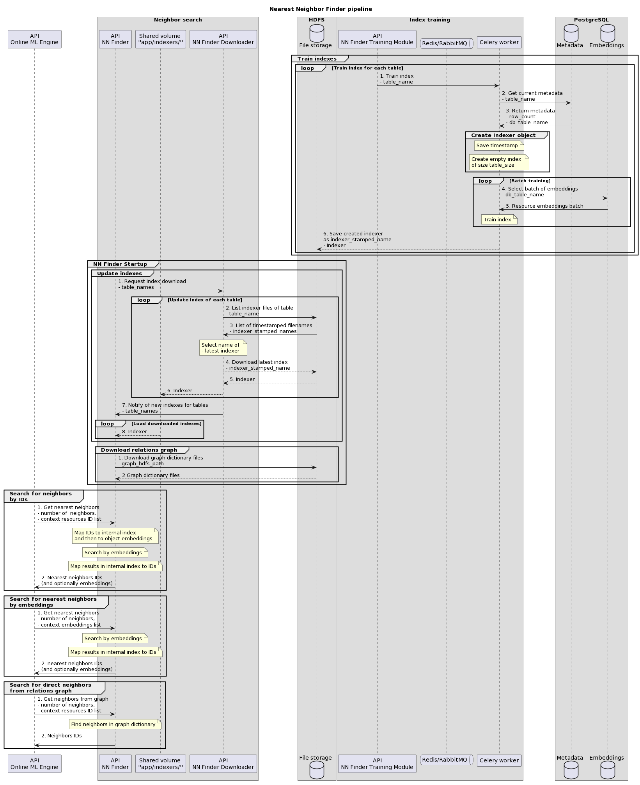
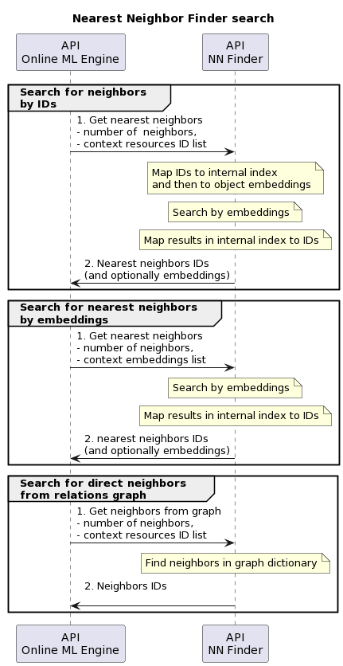
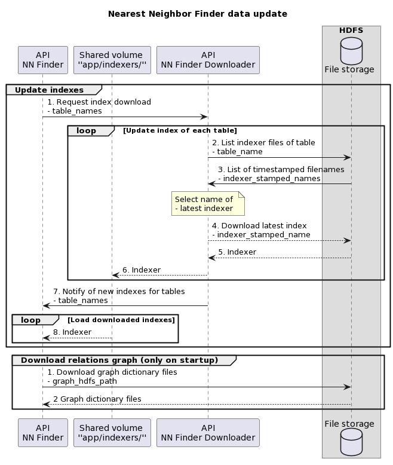

# Licence

<! --- SPDX-License-Identifier: CC-BY-4.0  -- >

## System Architecture

Nearest Neighbor Finder consists of one main app and two supporting modules:

1. **NN Finder** - main app serving nearest neighbor search requests
2. **NN Finder Downloader** - app serving as a buffer for index updates. This module is required for the main app to fully function in its default configuration. It allows the NN Finder to continuously serve requests while newly trained indexes are downloaded from HDFS storage.
3. **NN Finder Training Module** - module conducting the training of indexes and passing the train tasks to celery workers. It works independently from the main app and only communicates with HDFS storage. Training is performed ad hoc (on API request) for resource indexes, and dynamically (every 30 minutes) for user indexes.



This repository contains the main NN Finder module and the supporting Downloader service. The Training Module documentation is stored in a [separate repository](https://git.man.poznan.pl/stash/projects/EOSC-RS/repos/nearest-neighbor-finder-training-module/).

The data for the operation of modules in this repository are stored in HDFS, more specifically an Index Storage directory, as well as directory with files representing of the relations graph. These directories can be specified using the `HDFS_USER`, `INDEX_TAG` and `GRAPH_HDFS_PATH` environment variables, as described in [Configuration](CONFIGURATION.md).

### Dependencies

Requirements for the described modules are:
- **Docker**
  - [docker-compose](https://docs.docker.com/compose/install/)
- **Python 3.8**
  - Packages listed out in [requirements.txt](requirements.txt) will be installed when building docker image
- **HDFS** containing the following data:
  - indexer files containing indexes trained with the current `INDEX_TAG`, stored under path `user/{HDFS_USER}/nn-finder/{INDEX_TAG}`
  - graph connection dictionaries 'direct_connections.map.json.zst' and 'direct_connections.int.json.zst' stored under path indicated by `GRAPH_HDFS_PATH`
- **`/app/indexers/` Shared Volume** for passing indexes from Downloader to NN Finder.

In case of emergency index training using NN Finder instead of Training Module (details in [Troublehooting](TROUBLESHOOTING.md)) another dependency is required:
- **PostgreSQL** containing the following tables of embeddings:
  - in `metadata` schema: table for both resource types, each containing entries for every table of that type
  - in `"resources"` schema: `"datasets", "publications", "software", "services", "other_research_product", "trainings", "data_srouces"`
  - in `"users"` schema: `"users", "users_aai", "users_anon"` with columns for each configuration of user actions (ordered, visited) x resources (datasets, publications, services, software, trainings, other_research_product, data_sources)

### Nearest Neighbor Finder



#### Overview

The Nearest Neighbor Finder functions as an FastAPI application. The basic functionality is to provide an endpoint for finding k most similar objects given a context object by its ID or embedding. For each type of resource (list under PostgreSQL in [Dependencies](#dependencies)), there is a separate endpoint that allows querying for the nearest neighbors. Apart from resources, similarity search can also be performed on users (list also in[Dependencies](#dependencies)). The indexes for user search are updated dynamically.

Apart from the object embedding similarity search, similar resources can be found using the relations graph. The results are resources directly connected in the graph to the context resource. There is a single endpoint for searching in all resource types.

#### NN Finder submodules - Downloader and Training Module
NN Finder requires the [NN Finder Downloader](#nn-finder-downloader) and [NN Finder Training Module](#nn-finder-training-module) to be deployed and running in order to function properly. On startup, the NN Finder communicates with the Downloader in order to retrieve all required indexes from HDFS, which were previously trained by the Training Module. The index download procedure will be repeated during the NN Finder's lifetime, as new indexes are dynamically trained and downloaded from HDFS. At the end of startup, the NN Finder also connects directly to HDFS and downloads relations graph files - this operation does not need Downloader's involvement, as it happens only once.

#### Search results

The result of similarity search consists of not only resource IDs, but also the approximate distance of the result from the query. Optionally, the embeddings of found resources can also be returned.

The results of relations graph search are resources directly connected in the graph to the context resource. There is a single endpoint for searching in all resource types.

### NN Finder Downloader

The NN Finder Downloader is also an FastAPI application, but it only serves requests for NN Finder.



NN Finder may need updating its indexes - either on startup, periodic user index update or on developer's request using `/update_index`. In any of those cases it passes the list of required indexes to the Downloader by the `/download_index` endpoint. On such request, Downloader pulls index from HDFS and stores it in the `/app/indexers/` shared volume, after which it orders NN Finder to load the new files into working memory using `/load_index` endpoint.

### NN Finder Training Module


The Training Module is documented in its own separate [repository](https://git.man.poznan.pl/stash/projects/EOSC-RS/repos/nearest-neighbor-finder-training-module/)

### API

#### NN Finder API

##### Search endpoint

The `/search/{table}/{qtype}/` endpoint in its simplest form takes the context items of a specified table (type of resource or user objects), the type of search we want to use based on the qtype value of "emb" or "id", and the required parameter k standing for the number of neighbors returned for every context item provided. Context data is passed in the request body JSON. In case of "id"  request, the "id" value contains a list of database ID strings for each context item. In emb  requests, the "emb" value is a string containing a 2D array of embeddings using floating-point values, where rows correspond to the items. Example body JSON:

```JSON

{
  "emb": "[[0.1, 0.2, ...], [0.55, ...], ...]" or None,
  "id": ["id1", "id2", ...] or None
} 
```

Example response after searching for 3 neighbors of "services" objects with IDs 47 and 49:

```JSON
{
  "status": "search completed",
  "n_results_returned": [
    4,
    4
  ],
  "result": [
    [
      "47",
      "500",
      "69",
      "490"
    ],
    [
      "49",
      "418",
      "525",
      "1032"
    ]
  ],
  "distance": [
    [
      0,
      13.69386100769043,
      15.4530668258667,
      16.09517478942871
    ],
    [
      0,
      11.680252075195312,
      11.994568824768066,
      13.849782943725586
    ]
  ],
  "timestamps": [
    1697183017.6029003,
    1697183017.6719923
  ],
  "searched_ids": [
    "47",
    "49"
  ]
}
```

The returned search result is a list of lists, each consisting of `k + 1` IDs of most similar objects to the ones provided in the search context body. One additional result is returned, because the first, nearest object may sometimes be a copy of the context item itself - it is so in this case, which is shown by distance 0 of the first result. If needed, it can be skipped from final result using `trim_first` parameter. Optionally, the embeddings of returned objects will be returned if the parameter `get_embs` is set.

If the table corresponds to user objects ( tables `users`, `users_aai`, `users_anon`), additional parameters have to be provided in order to specify the table, which are `user_action` and `user_resource`.

##### Graph search endpoint

The `/search_graph` endpoint allows the user to search for an object in a relations graph and get the objects adjacent to it.

The graph search requires a list of IDs of context resources.

Example body:

```JSON
[
  "50|dedup_wf_001::46ac36dafa82041e3bb065e4878d4617",
  "50|doi_dedup___::73210f281dde82edfe3304ada044dbd5"
]
```

Example response:

```JSON
{
  "status": "search completed",
  "50|dedup_wf_001::46ac36dafa82041e3bb065e4878d4617": {
    "datasets": [
      "50|dedup_wf_001::894c19bdd39d4ec9b398a07c3eaa467b",
      "50|dedup_wf_001::3d9165d49ac88116b3364ba4e41460cf",
      ...
    ]
  },
  "50|doi_dedup___::73210f281dde82edfe3304ada044dbd5": {
    "datasets": [
      "50|dedup_wf_001::2182b6aebd20e12dee2f7af42c827178",
      "50|dedup_wf_001::351025c50535b170daff155c15fe3f5d",
      ...
    ],
    "publications": [
      "50|doi_dedup___::44327ae5559db6fe734b01e840197583",
      "50|doi_________::49be87c99ed693e11b0fef10eac1cbe7",
      ...
  ]
  }
}
```

##### Update index endpoint

The `/update_index` endpoint loads the listed pre-trained indexes stored in HDFS to app memory, indicated by a list of table names in the tables parameter.  Same as in the search endpoint, the user_action and user_resource parameters must be specified for users tables. Indexes specified in `INIT_TABLES` are loaded automatically on startup, and the indexes of user tables specified in `DYNAMIC_TABLES` are loaded dynamically every 30 minutes, as they are cyclically trained by the NN Finder Training Module.

In order to load the indexes dynamically while also serving search requests, the additional service [NN Finder Downloader](#nn-finder-downloader) runs in parallel and downloads the indexes from HDFS to a volume shared between it and the main API `/app/indexers`. On each `/update_index` request, or when the user indexes are dynamically loaded, the main NN Finder app sends a [download request](#download-index-endpoint) to the Downloader. When Downloader finishes the download, it notifies the main NN Finder app that new indexes are available in shared volume by calling its `/load_index` endpoint.

##### Diagnostic endpoint

The endpoint `/diag` is used to check the state of the API. If the app is running properly, this endpoint should return a `200` response with a `status: "UP"`, as well as states of modules that the application depends on. HDFS and Downloader connection status is checked.

Setting the flag `details` to `True` will list out additional information about the data contained in the app and its dependencies. If `ALLOW_TRAINING` is set to `True` (when [troubleshooting the absence of indexes](TROUBLESHOOTING.md/#temporary-solution-for-when-hdfs-does-not-contain-the-indexes-and-training-module-or-its-dependencies-are-down)), PostgreSQL connection will also be checked, returning a list of tables on which new indexes can be trained.

Example response with the parameter `details=True`:

```JSON
{
  "status": "UP",,
  "version": "1.4.2",
  "index tag": "1.4.2",
  "celery": {
    "status": "UP"
  }
  "hdfs": {
    "status": "UP",
    "datasets_indexer": [
      "datasets-230727062945.pickle",
      "datasets-230727143755.pickle"
    ],
    "publications_indexer": [
      "publications-230726090528.pickle",
      "publications-230727144621.pickle"
    ],
    "software_indexer": [
      "software-230727063039.pickle",
      ....
    ],
    "otherresearchproduct_indexer": [
      "otherresearchproduct-230727143755.pickle",
      ...
    ],
    "services_indexer": [
      "services-230727143755.pickle",
      ...
    ],
    "trainings_indexer": [
      "trainings-230727143755.pickle"
      ...
    ],
    "users_indexer": [
      "users-datasets-ordered-230606133556.pickle",
      "users-datasets-ordered-230606140140.pickle",
      ...
      "users-datasets-visited-230801080908.pickle",
      ...
      "users-otherresearchproduct-ordered-230801080913.pickle",
      ],
    ...
  },
  "pg": {
    "status": "UP",
    "available_tables": [
      "services",
      "datasets",
      "publications",
      "software",
      "trainings",
      "otherresearchproduct",
      "users",
      "users_aai",
      "anon_users"
    ]
  }
}

```

#### NN Finder Downloader API

##### Download index endpoint

The `/download_index` endpoint is called by NN Finder every time the app needs to update the indexer files. NN Finder passes the names of tables for the requested indexes, and Downloader copies the latest index files from HDFS to the volume `/app/indexers`. After fetching all files, Downloader calls NN Finder's `/load_index` notifying it about which indexes were downloaded successfully and will be downloaded.

##### Diagnostic endpoint

The `/diag` endpoint is called by NN Finder upon request on its own `/diag`, and the content returned by Downloader is included in NN Finder response under the key "downloader".

The specific contents of Downloader diag's response can be seen above in NN Finder's response.

#### Training Module API

The Training Module is documented in its own separate [repository](https://git.man.poznan.pl/stash/projects/EOSC-RS/repos/nearest-neighbor-finder-training-module/)
