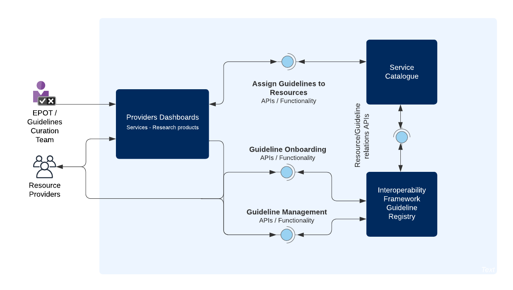

# Licence

<! --- SPDX-License-Identifier: CC-BY-4.0  -- >

### Important note

*Interoperability Registry is inherently connected with the Service Cataloge Infrastructure, sharing common resources, installation and deployment. Hence, same policies, instructions and procedures apply for both components.* 

## System Architecture

### High-level Service Architecture

The following picture explains the general architecture of the EOSC Interoperability Registry and EOSC component interactions

* EOSC Interoperability Framework Registry: The Interoperability Registry is public and open access collection of Interoperability Guidelines uploaded by Providers. These guidelines can be managed curated in the same way with the other Service Catalogue resources, through the EOSC Providers Portal. Moreover, these Interoperability Guidelines can be "linked" to Resources, facilitating composability and compatibility between onboarded resources.
* EOSC Service Catalogue: The EOSC Service Catalogue is the repository component offering the necessary programmatic interfaces for the addition, modification, and access to information regarding providers, resources and user activity collected in the EOSC portal.
* EOSC Providers Portal: The EOSC Providers Portal components offer front-end functionality to users representing a Provider organisation, who wish to onboard their organisation and onboard resources in the EOSC Resource Catalogue, to manage and customise the way offerings are presented to end users and finally to gain insights on a multitude of usage statistics, user-generated events and statistics collected. 
