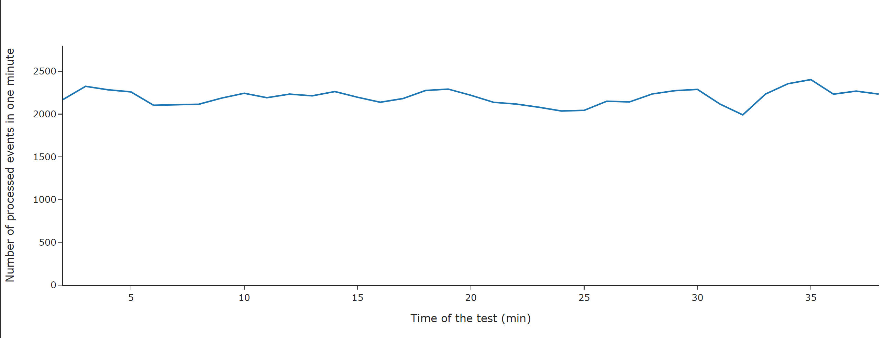

# Licence

<! --- SPDX-License-Identifier: CC-BY-4.0  -- >

## Monitoring consumption of computing resources

When monitoring the consumption of computing resources, it is essential to distinguish between
local and containerized environments. For applications running locally, utilize native
system tools to track resource usage. These tools can offer detailed insights and are specific to
the operating system in use. On the other hand, when operating within a Docker environment,
leverage container monitoring tools. These tools are designed to provide metrics and performance data
specifically for containerized applications, ensuring accurate and efficient resource tracking across
all containers.

## Scaling and Performance

In order to increase the throughput of the application as the load increases,
it is necessary to increase the computing resources, i.e. RAM and CPU allocated to
the docker container.

With the increase in available resources, it may be necessary to redefine the number
of workers. Their number is determined by environment variables:
- `NUMBER_OF_PROCESS_SWITCHES` and `NUMBER_OF_STORING_SWITCHES` for user action processing.
- `SPARK_EXECUTOR_CORES`, `SPARK_DRIVER_CORES`, `SPARK_NUM_EXECUTORS`, `SPARK_EXECUTOR_MEMORY`,
`SPARK_DRIVER_MEMORY` `SPARK_EXECUTOR_MEMORY_OVERHEAD`, `SPARK_DRIVER_MEMORY_OVERHEAD`
for resource processing (on spark)

- For details, see [Configuration](CONFIGURATION.md).
## Load tests

The load test emulates kafka messages with user actions (UA).



The UA are anonymous users, with 20% of new users and one with one of resource type:
- datasets
- publications
- software
- other research product
- services

Tests have shown that this module is able to handle an average of 2200 user actions per minute.

To perform such test user need to use script in `nearline_app/scripts/load_tests` for example in such way:

```bash
python main.py --kafka_server test_server --kafka_topic test_topic --save_path history --num_of_generators 2 --nearline_address http://localhost:8000/diag
```

where:
- `kafka_server` - kafka on which simulation would be performed server address
- `kafka_topic` - kafka topic on which simulation would be performed
- `save_path` - path to folder where save history of simulation
- `num_of_generators` - number of generators of UA (the more, the bigger load)
- `nearline_address` - address of nearline app diagnostics endpoint (`http://localhost:8000/diag`)

This script is independent of the nearline app and don't need to be run on the same machine,
hence `.env` file is not needed. Test last until user stops it.

User can view load using local fastapi app (`http://localhost:8001/docs`),
or use results from `save_path` to analyze and visualize results.

Above result was obtain for module running in docker container with 2 CPU and 4GB RAM.
