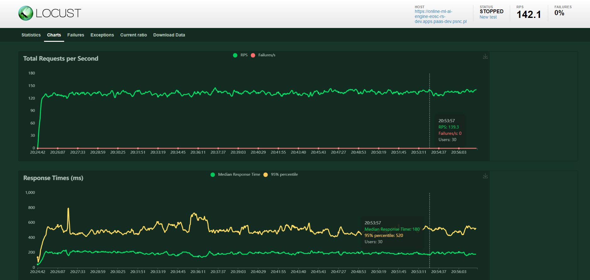
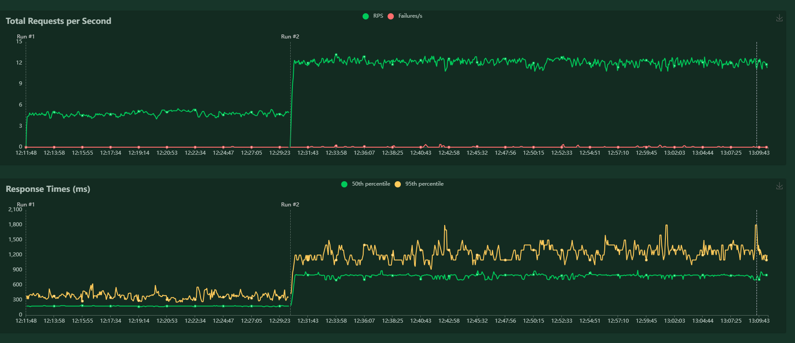

# Licence

<! --- SPDX-License-Identifier: CC-BY-4.0  -- >

## Monitoring consumption of computing resources

Monitoring resource utilization, including CPU and RAM, is essential for maintaining optimal system throughput. System resource monitoring should be employed to track and analyze the consumption of computational resources, ensuring efficient operation. 
In the case of running on bare metal or a virtual machine, leveraging the built-in system resource monitoring tools is recommended. However, when deploying the service in a Docker container, it is essential to utilize monitoring tools from the platform on which it is running.

To assess the throughput of specific resources, it is necessary to conduct load testing.

## Scaling and Performance

In order to increase the throughput of the application as the load increases, it is necessary to increase the computing resources, i.e. RAM and CPU allocated to the docker container.

With the increase in available resources, it may be necessary to redefine the number of workers. Their number is determined by environment variables `WORKERS_PER_CORE` and `WEB_CONCURRENCY`. For details, see [Configuration](CONFIGURATION.md).

If the number of users increases significantly, an additional  instances of Online engine and Nearest neighbor finder should be launched and a load balancer should be added.

## Load tests

The load test emulates requests sent from the RS Facade to the API of the Online engine (version 1.3.0) 

{width=50%}

The load tests simulated logged-in and anonymous users sending requests for recommendations in a 1:1 ratio.

The test was performed using the [Locust](https://locust.io/) tool with [test configuration](../tests/performance/locustfile_online.py).

The queries were for one of the following resources:

- datasets,
- publications,
- software,
- training materials,
- other research product.

Tests have shown that this module is able to handle an average of 130 queries per second and a median response time: 190 ms.

The load test emulates requests for sorting 50 resources sent from the RS Facade to the API of the Online engine (version 1.6.0)

{width=50%}

The tests were conducted using a service running in an OKD environment in the form of a docker pod with 3 CPUs and 6GiB RAM.