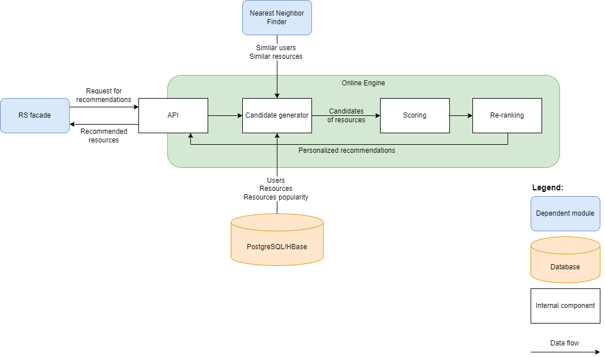

# Licence

<! --- SPDX-License-Identifier: CC-BY-4.0  -- >

## System Architecture

The application consists of 3 main components:
* Candidate generator - Generates candidate resources that are potentially relevant to the user,
* Scoring - sorting candidates by relevance or popularity,
* Re-ranker - resource re-ranking.

### Interaction with other components of RS

The external services that Online Engine connects to are:
* Databases (PostgreSQL / HBase) -  store information about metadata, users, resources and their popularity,
* Nearest Neighbor Finder - is used to find the most similar users and resources,
* RS facade - sends requests for recommendations. In response, Online engine returns lists of IDs of recommended resources along with explanations, and its scores.

### Candidate generator

The candidate generator provides a preliminary subset of resources that can be further processed by scoring and re-ranking algorithms. 

Candidate selection can be carried out through the following methods:
- Identifying resources that are most similar to those recently viewed/ordered by the user.
- Identifying resources that are most similar to the resource the user wishes to view, based on their user profile.
- Considering resources that have been viewed/ordered by users with similar preferences.
- For anonymous users or those who have not interacted with any resource, popular resources are considered as potential candidates.
- When sorting resources, candidates are generated by the Search Service and included in the request.

No information about the user search context is provided along with the request therefore, they are not used in the process of making recommendations.

### Scoring

The main objective of the scoring block is to select the most relevant resources that can be recommended to the user. Scoring algorithms analyze the entire set of candidates (which may come from various sources) and evaluate all of them in terms of the likelihood of a user selecting that resource. They provide a further selection of candidates by assigning each item a rating of relevance according to different objective functions.  For each resource, a score or utility value corresponding to the user's preferences is computed. Machine learning models used in this step utilize precomputed features describing users and resources. At inference, they make use of feature representations of users and resources fetched from internal databases. 

### Re-ranking

Re-ranking algorithms are the last stage of the Online engine module. They perform further processing of lists of recommendations obtained from scoring modules to ensure additional qualities, such as unexpectedness, serendipity, or novelty. Diversification balances the tradeoff between list relevance and redundancy, where suggestions showing only the most relevant services lack variety and can discourage engagement. The least information required for re-ranking is relevance scores provided by the scoring algorithms and a similarity metric between a given pair of services, which can be based on service features, or user interaction. When more user behavior data is available, such as recommendation interactions history, information about what type of recommendation lists are the most suitable for users can be learned by used by the algorithms. Users’ collective or personal tendency to click popular or niche services or the preferred diversity/relevance tradeoff in the list, can be learned by neural networks.

The final forms of explanation of the recommendation are constructed here, taking into account:

- panel type,
- resource type,
- the procedure for selecting this resource as a candidate,
- scoring method.